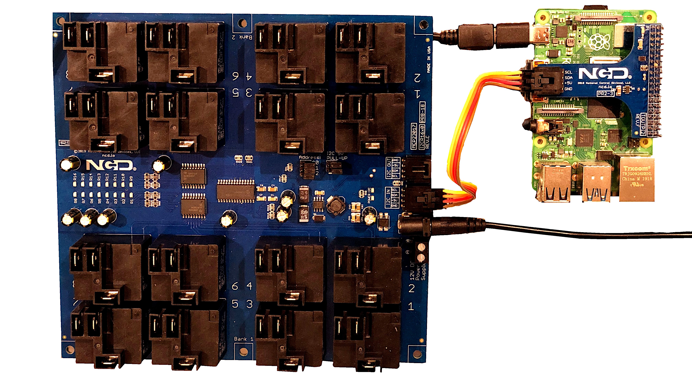
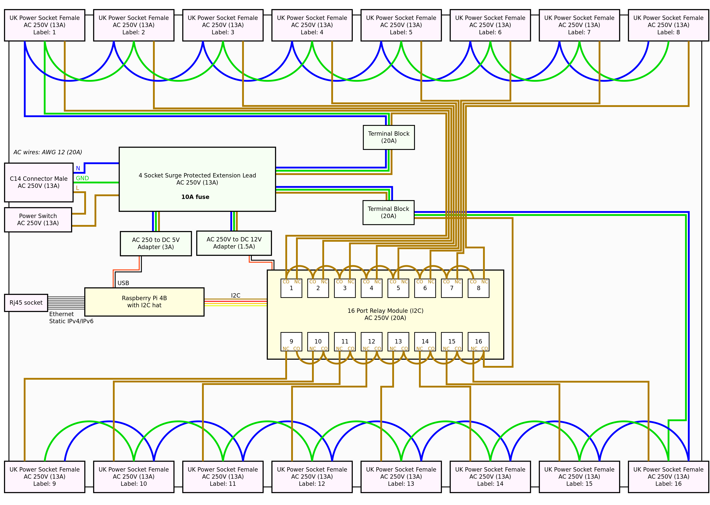
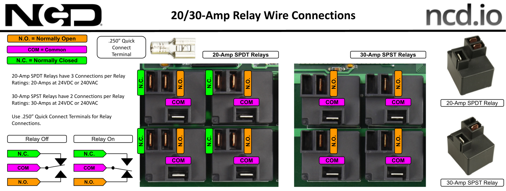
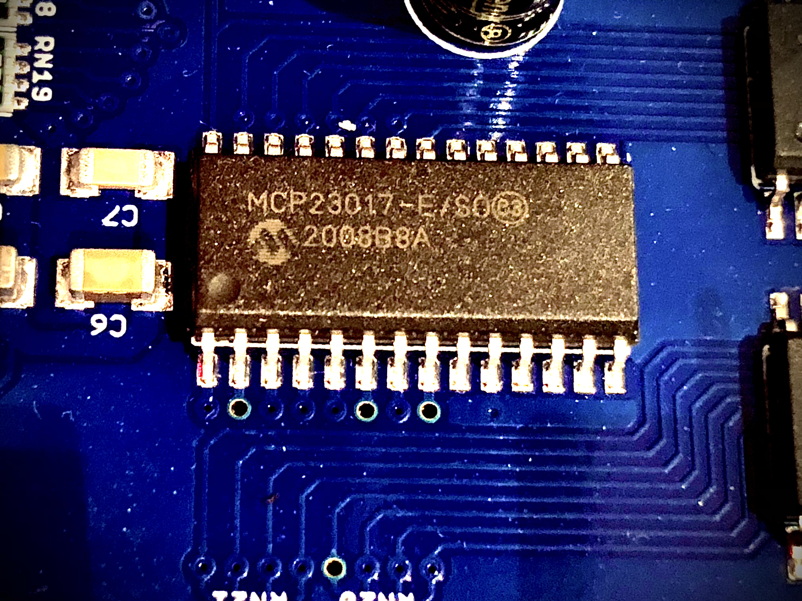
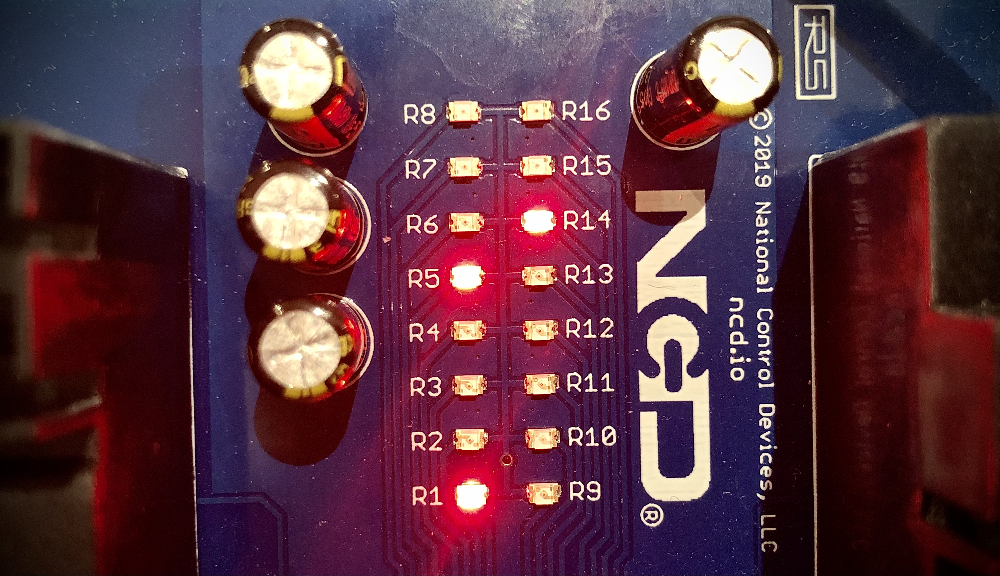

# Table of Contents
 - [1 Introduction](#1-introduction)
 - [1.1 Intended use](#11-intended-use)
 - [1.2 Functionality](#12-functionality)
 - [2 Hardware](#2-hardware)
 - [2.1 Wiring diagram](#21-wiring-diagram)
 - [2.2 16-Channel High-Power Relay Controller](#22-16-channel-high-power-relay-controller)
 - [2.2.1 Relay](#221-relay)
 - [2.2.2 I2C interface](#222-i2c-interface)
 - [3 Software](#3-software)
 - [3.1 Relay Control Library](#31-relay-control-library)
 - [3.2 Relay Control Tool](#32-relay-control-tool)

## 1 Introduction
The socket extension relay controller project is essentially a programmable timer with developer friendly functionality. Instead of the typical mechanical or electrical timer that is connected to the wall socket this device offers much more functionality. It is controlled via Ethernet or WiFi using a Raspberry Pi.

Also, it is not just a single socket, it provides 16 surge protected sockets, each individually programmable using relays.

### 1.1 Intended use
It is intended for common digital equipment in a home (no power hungry kitchen appliances). The majority of the connected devices don't consume that much power, but each may need to be controlled differently. Many devices fall within the 0-20W range, some within 20-60W and a few with very high rating. As with anything electrical, awareness of what is being connected and the maximum power consumption is needed. As a safety, an overall 10A fuse (2300W for AC 230V) ensures that in the case of too many devices connected that will be the weakest point and power is cut.

Power consumption examples of connected devices (power rating, power consumption is typically lower):

**1) Computer System:**
 - USB charger (6W)
 - Laptop (50W)
 - Network switch (5W)
 - Low/medium grade desktop PC (300-600W)
 - Desktop monitor (35W)
 - Printer (50W)
 - Embedded system (10-60W)

**2) Entertainment System:**
- TV (150W)
- Receiver and speakers (200W)
- Cable box (35W)
- DVD/Bluray player (15W)
- Video game console (150W)
- Chromecast device (2W)
- Raspberry Pi (15W)

**3) Other:**
- Radio (5W)
- Christmas LED lights (3W)
- Decorative lights (10W)
- Artificial plant light (24W)

As seen above, when using normal devices (but no devices with extremely high ratings) the power consumptions is moderate. Whenever needed this project can be duplicated using more than one socket extension relay controller to connect more devices.

### 1.2 Functionality

Each socket is individually configured. Typically most connected sockets in are always on during daytime, saving power at night. Then for a selected number of sockets custom setups are used (e.g. christmas tree lights).

Access to the controller can be done in various ways. The first one is the initial scope. The rest are possibilities that allows further integration with other systems:

**1) Web site interface:**
- Manual control of relays (all on, all off, individual control on/off)
- Configure relay activiation rules, e.g. 7am daily, 7am on weekdays, 10am on weekends, 2pm on a specific YYYY-MM-DD, hourly, weekly, monthly, random or always on
- Configure relay duration rules, e.g. 2h, 2 days, 2 weeks, 2 months, random duration or no limit
- Relay monitoring graphs and stats

**2) HTTP JSON API**
 - This allows easy integration with many existing frameworks

**3) Custom UDP/TCP protocol**
 - This allows easy integration with other software systems
 
### 2 Hardware

Relays should not be activated with loads close to its maximum rating. Thererfore, with an overall maximum power rating of 10A using the typical 10A relays is not good enough. Also, since this is AC 230V buying cheap components on the net with no guarantees is likely to break at any time. So a high quality industrial grade 20A relay controller is used from National Control Devices (NGD). They also provide an I2C interface hat to Raspberry Pi:
 


### 2.1 Wiring diagram

The wiring diagram is central describing how everything is connected.

The overall idea is that that the relays, cables, terminal blocks, sockets, switches are rated higher than the deliberate bottleneck that is the 10A fuse.

In general, colour coded wires are used to indicate the purpose of each wire. For high power cables, AWG 12 is used, which uses 3.31 square mm and matches the rating and connectors of the relays.

**WARNING: Working with high voltage AC 230V should be managed with extreme caution and only if you know what you are doing!**



### 2.2 16-Channel High-Power Relay Controller

The relay controller could potentially be daisy chained via the I2C interface to increase the number of supported relays. In general this may be a useful feature in the future when connecting a larger number of low powered devices. An example of this would be a cluster of Raspberry Pi devices with on demand compute power management. It can scale up and down devices based on the performance need (such a project would not need 20A relays).

## 2.2.1 Relay

The selected Relay is intended for resistive loads. Thus not inductive loads such as motors, solenoids, and other devices that implement a collapsible magnetic field.


For this project, normally open relay configuration is used:



### 2.2.2 I2C interface

The Linux I2C device on Raspberry Pi is used to control the relay module:

```
i2cdetect -l
i2c-1	i2c       	bcm2835 (i2c@7e804000)          	I2C adapter
```

The device is found on address 0x20:
```
i2cdetect -y 1
     0  1  2  3  4  5  6  7  8  9  a  b  c  d  e  f
00:          -- -- -- -- -- -- -- -- -- -- -- -- -- 
10: -- -- -- -- -- -- -- -- -- -- -- -- -- -- -- -- 
20: 20 -- -- -- -- -- -- -- -- -- -- -- -- -- -- -- 
30: -- -- -- -- -- -- -- -- -- -- -- -- -- -- -- -- 
40: -- -- -- -- -- -- -- -- -- -- -- -- -- -- -- -- 
50: -- -- -- -- -- -- -- -- -- -- -- -- -- -- -- -- 
60: -- -- -- -- -- -- -- -- -- -- -- -- -- -- -- -- 
70: -- -- -- -- -- -- -- --     
```
The relay module uses a MCP23017 I/O chip to control the relays:




The control register summary (TABLE 1-6) indicates that {GPIOA, GPIOB} need to be set to 0xff. Also, {IODIRA, IODIRB} need to be set using an inverted bitfield value to control individual relays. This is clarified below:
```
# Setup:
i2cset -y 1 0x20 0x12 0xff # GPIOA
i2cset -y 1 0x20 0x13 0xff # GPIOB

i2cset -y 1 0x20 0x00 0xff # IODIRA, deactivate relay #1-8
i2cset -y 1 0x20 0x01 0xff # IODIRB, deactivate relay #9-16

# Iterate through all relays
i2cset -y 1 0x20 0x00 0xfe # IODIRA, activate relay #1
i2cset -y 1 0x20 0x00 0xfd # IODIRA, activate relay #2
i2cset -y 1 0x20 0x00 0xfb # IODIRA, activate relay #3
i2cset -y 1 0x20 0x00 0xf7 # IODIRA, activate relay #4
i2cset -y 1 0x20 0x00 0xef # IODIRA, activate relay #5
i2cset -y 1 0x20 0x00 0xdf # IODIRA, activate relay #6
i2cset -y 1 0x20 0x00 0xbf # IODIRA, activate relay #7
i2cset -y 1 0x20 0x00 0x7f # IODIRA, activate relay #8
i2cset -y 1 0x20 0x01 0xfe # IODIRB, activate relay #9
i2cset -y 1 0x20 0x01 0xfd # IODIRB, activate relay #10
i2cset -y 1 0x20 0x01 0xfb # IODIRB, activate relay #11
i2cset -y 1 0x20 0x01 0xf7 # IODIRB, activate relay #12
i2cset -y 1 0x20 0x01 0xef # IODIRB, activate relay #13
i2cset -y 1 0x20 0x01 0xdf # IODIRB, activate relay #14
i2cset -y 1 0x20 0x01 0xbf # IODIRB, activate relay #15
i2cset -y 1 0x20 0x01 0x7f # IODIRB, activate relay #16
```

This functionality  is programatically controlled with the I2C device:
```
root@raspberrypi:/home/pi# ls -l /dev/i2c-1 
crw-rw---- 1 root i2c 89, 1 Jan 23 23:17 /dev/i2c-1
```

### 3 Software

### 3.1 Relay Control Library

The library abstracts all details about the I2C interface (chapter 2.2.2) and exposes a generic API for applications. It is written in C to make it possible to integrate it everyone.

Using the library is straightforward:
```
#include <stdio.h>
#include <unistd.h>

#include <rc/relay.h>

int main(int argc, char* argv[])
{
     rc_relay_channel_init();

     rc_relay_channel_t channels = rc_relay_channel_01 |
                                   rc_relay_channel_05 |
                                   rc_relay_channel_14;

     rc_relay_channel_set(channels, true);

     sleep(2);

     rc_relay_channel_set(channels, false);

     return 0;
}
```



### 3.2 Relay Control Tool
The command line tool makes it easier to manually control relay states without using the potentially dangerous command i2cset. It is essentially a CLI wrapper around the library.

```
rc_ctrl -c "relay_07 on"
rc_ctrl -c "relay_07 query"
value: true
rc_ctrl -c "relay_07 off"
value: false
rc_ctrl -c "relay_all on"
rc_ctrl -c "relay_all off"
```
